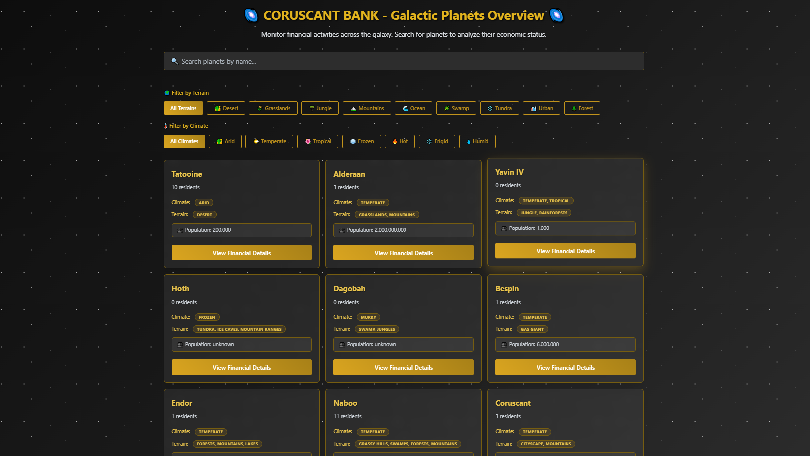
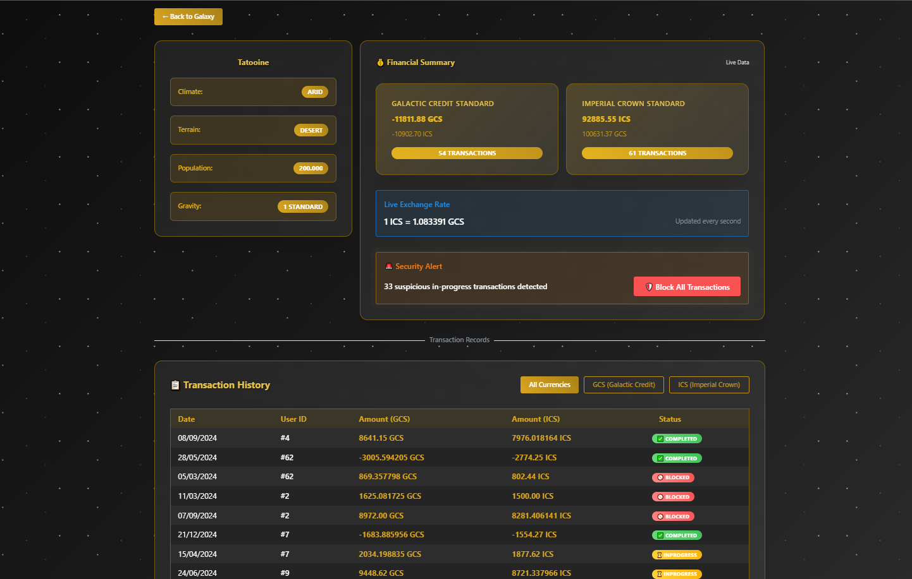

# Coruscant Bank - Galactic Financial Monitoring System 🌌

## Project Overview

This application is a comprehensive solution for Coruscant Bank administrators to monitor financial activities across the galaxy, analyze transactions by planets, and manage security risks from suspicious activities in the post-Empire era.

## Screenshots

### Summary



### Planet Detail



## Technical Architecture

### Core Technologies

- **React 18.2.0** with TypeScript 5.6.3
- **React Query (TanStack Query 5.62.0)** for API state management
- **React Router DOM 6.28.0** for navigation
- **Mantine UI 7.13.4** for component library
- **Styled Components 6.1.8** for additional styling
- **Decimal.js 10.4.3** for precise financial calculations
- **Axios 1.7.7** for HTTP requests
- **MirageJS 0.1.48** for mock server implementation

### Project Structure

```
src/
├── components/              # Reusable UI components
│   ├── FinancialSummary/   # Financial summary components
│   ├── TransactionTable/   # Transaction display components
│   ├── skeletons/          # Loading state components
│   └── ...                 # Other shared components
├── constants/              # Configuration and static data
├── hooks/                  # Custom React hooks
│   ├── api/               # API-related hooks
│   └── ...                # Business logic hooks
├── pages/                  # Main page components
├── routes/                 # Routing configuration
├── types.ts               # TypeScript type definitions
├── utils/                 # Utility functions
└── mockData/              # Mock data for development
```

## Features Implemented

### Core Requirements

#### 1. Summary Page

- ✅ **Planet Overview**: Displays all planets in a responsive grid layout
- ✅ **Search Functionality**: Real-time search by planet name with debounced input
- ✅ **Planet Cards**: Interactive cards showing planet information with navigation to details

#### 2. Planet Detail Page

- ✅ **Planet Information**: Comprehensive display of planet details (climate, terrain, population, etc.)
- ✅ **Financial Summary**: Real-time currency totals with exchange rate conversion
- ✅ **Transaction Filtering**: Custom-built currency filter (GCS/ICS/All) without UI libraries
- ✅ **Real-time Exchange Rates**: Live conversion between GCS and ICS currencies
- ✅ **Transaction Table**: Sortable table displaying all transactions with status indicators

### Flexible Requirements (2 Selected)

#### ✅ 1. Transaction Security Management

**Implementation**: Complete solution for blocking suspicious transactions

- **Security Alert Component**: Visual warning when in-progress transactions are detected
- **Batch Transaction Blocking**: Single-click functionality to block all in-progress transactions for a planet
- **Real-time Updates**: Immediate UI updates after blocking operations
- **Status Management**: Visual indicators for transaction statuses (inProgress, completed, blocked)

#### ✅ 2. Advanced Planet Filtering

**Implementation**: Comprehensive filtering system for planets

- **Terrain Filter**: Multi-select filtering by terrain types (desert, grasslands, jungle, mountains, etc.)
- **Climate Filter**: Multi-select filtering by climate conditions (arid, temperate, tropical, frozen, etc.)
- **Combined Filters**: Search + terrain + climate filters work together
- **Real-time Filtering**: Instant results as filters are applied

### Technical Excellence Features

#### Responsive Design

- **Mobile-first approach** with responsive grid layouts
- **Optimized table layouts** with horizontal scrolling on small screens

#### Performance Optimizations

- **React Query caching** for efficient API data management
- **Component memoization** with React.memo for expensive renders
- **Debounced search** to reduce unecessary calculations
- **Skeleton loading states** for better UX during data fetching
- **Optimized re-renders** with useCallback and useMemo hooks

#### Type Safety

- **TypeScript coverage** across all components
- **Strict type definitions** for API responses
- **Enum usage** for constants and options
- **Interface definitions** for all data structures

## AI Usage Documentation

### Areas Where AI Was Used

All AI usage was flagged by adding the [AI] in the end of the commit coment. ALL AI work was tested, reviwed and updated by me before commiting the work.

#### 🤖 Components (AI-Generated)

- **`StarBackground.tsx`**: Animated background component with CSS animations
- **`skeletons/`**: Complete skeleton loading components suite
  - `FinancialSummarySkeleton.tsx`
  - `PlanetInfoTableSkeleton.tsx`
  - `TransactionTableSkeleton.tsx`
- **`SecurityAlert.tsx`**: Helped with animations

#### 🤖 Styling (AI-Assisted)

- **Theme configuration**: Custom Mantine theme with Star Wars-inspired colors
- **Animation effects**: Pulsing alerts, hover effects, and transitions
- **Custom gradients**: Star Wars themed color gradients

#### 🤖 Type Definitions (AI-Generated)

- **Enum definitions**: `CurrencyOpts`, `TransactionStatus`, `TerrainFilterOpts`, `ClimateFilterOpts`
- **Interface structure**: `FinancialSummary`, `PlanetFieldConfig`
- **Creation of othet types**

### Validation Checklist

- ✅ Planet search works with real-time filtering
- ✅ Terrain and climate filters function correctly
- ✅ Currency conversion displays accurate rates
- ✅ Transaction filtering by currency type works
- ✅ Security alerts appear for in-progress transactions
- ✅ Transaction blocking functionality works end-to-end
- ✅ All navigation and routing works properly
- ✅ Responsive design works across all screen sizes
